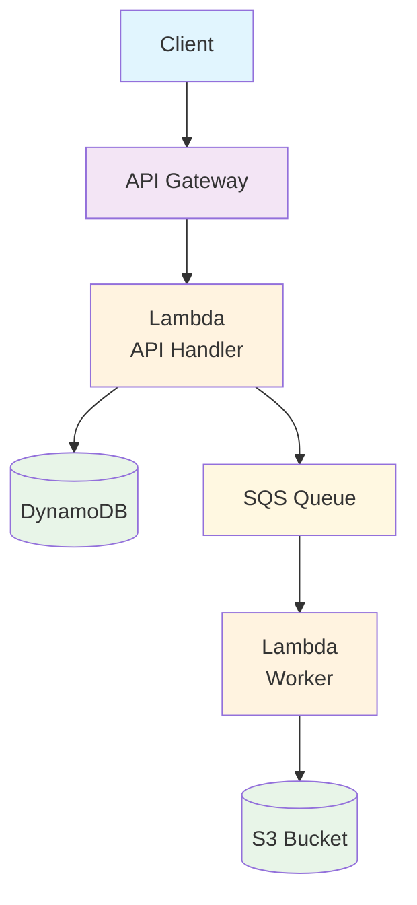

# LocalStack AWS Infrastructure Test Project

LocalStack を使用した AWS インフラストラクチャのテスト・開発環境プロジェクトです。

## 📋 概要

このプロジェクトは以下の AWS サービスを模擬する完全なローカル開発環境を提供します：

- **API Gateway**: RESTful API エンドポイント
- **Lambda**: サーバーレス関数実行
- **DynamoDB**: NoSQL データベース
- **SQS**: メッセージキューサービス
- **S3**: オブジェクトストレージ

## 🏗️ アーキテクチャ



## 🚀 クイックスタート

### 前提条件

- Docker Desktop
- Python 3.8+
- Terraform 1.0+
- AWS CLI v2

### セットアップ

1. **リポジトリのクローン**

```bash
git clone <this-repository>
cd LocalStackTest
```

2. **設定ファイルの準備**

```bash
# ローカル環境用
cp terraform/environments/local/terraform.tfvars.example terraform/environments/local/terraform.tfvars

# 本番環境用（必要に応じて）
cp terraform/environments/prod/terraform.tfvars.example terraform/environments/prod/terraform.tfvars
# terraform/environments/prod/terraform.tfvarsを編集してAWS設定を行う
```

3. **Python 依存関係のインストール**

```bash
pip install -r requirements.txt
```

4. **LocalStack の起動**

```bash
docker-compose up -d
```

5. **ローカル環境のデプロイ**

```bash
./scripts/deploy-local.sh
```

## 🧪 テスト

### API テスト

```bash
./scripts/test-api.sh
```

### データ持続性テスト

```bash
./scripts/check-persistence.sh
```

## 🔧 開発

### ローカル開発環境

```bash
# LocalStack起動
docker-compose up -d

# 開発用依存関係インストール
pip install -r requirements-dev.txt
```

### Terraform の操作

```bash
# ローカル環境
cd terraform/environments/local
terraform init
terraform plan
terraform apply
```

```bash
# 本番環境
cd terraform/environments/prod
terraform init
terraform plan
terraform apply
```

## 📁 プロジェクト構成

```
├── lambda/                  # Lambda関数
│   ├── api_handler.py      # API処理
│   └── worker.py           # バックグラウンド処理
├── terraform/              # インフラ定義
│   ├── environments/       # 環境別設定
│   └── modules/           # 再利用可能モジュール
├── scripts/               # 運用スクリプト
├── docs/                  # ドキュメント
└── docker-compose.yml     # LocalStack設定
```

## ⚠️ 注意事項

### セキュリティ

- `terraform.tfvars`ファイルには機密情報を含めないでください
- 本番環境の AWS 認証情報は環境変数または IAM ロールを使用してください
- LocalStack は開発環境専用です

### 本番環境デプロイ前に

1. `terraform/environments/prod/terraform.tfvars`の設定確認
2. 適切な AWS 認証情報の設定
3. セキュリティグループの確認
4. バックアップ戦略の策定
